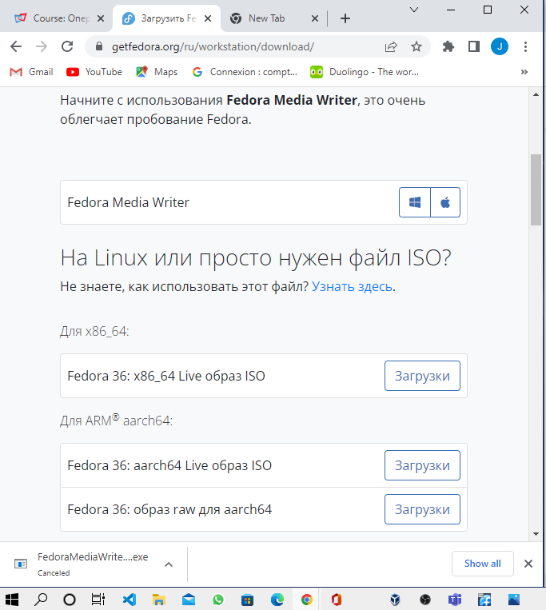
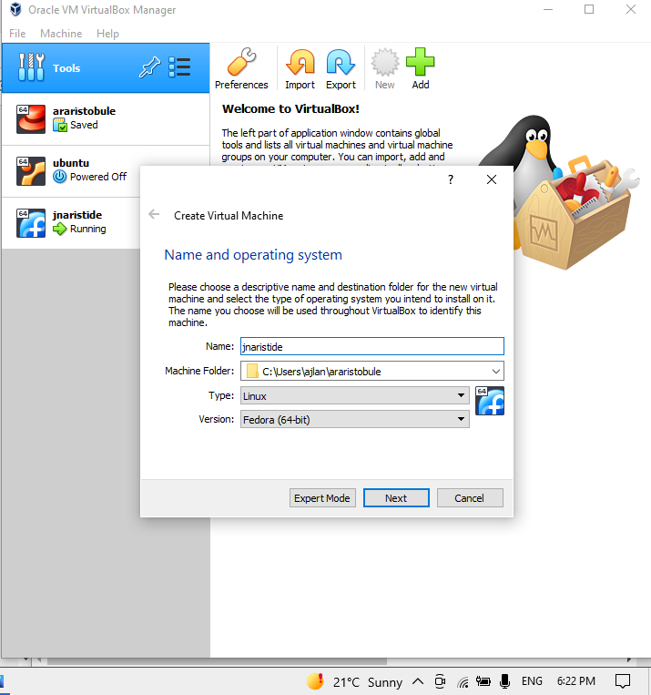
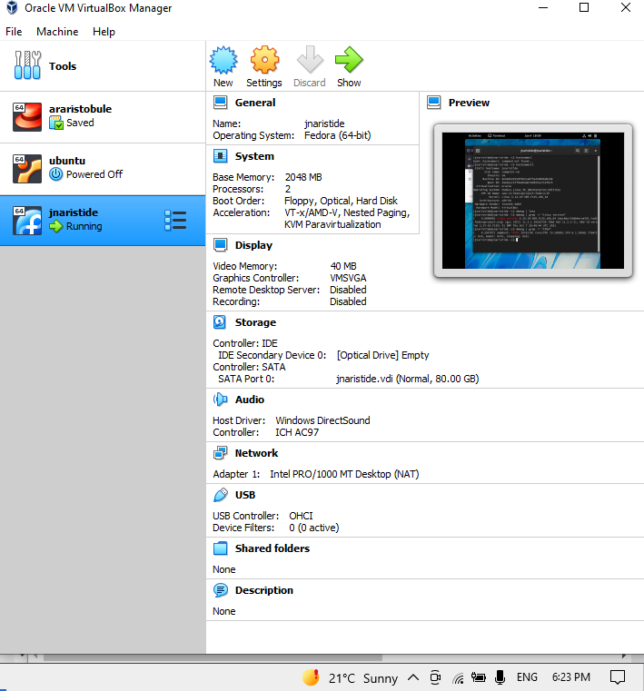
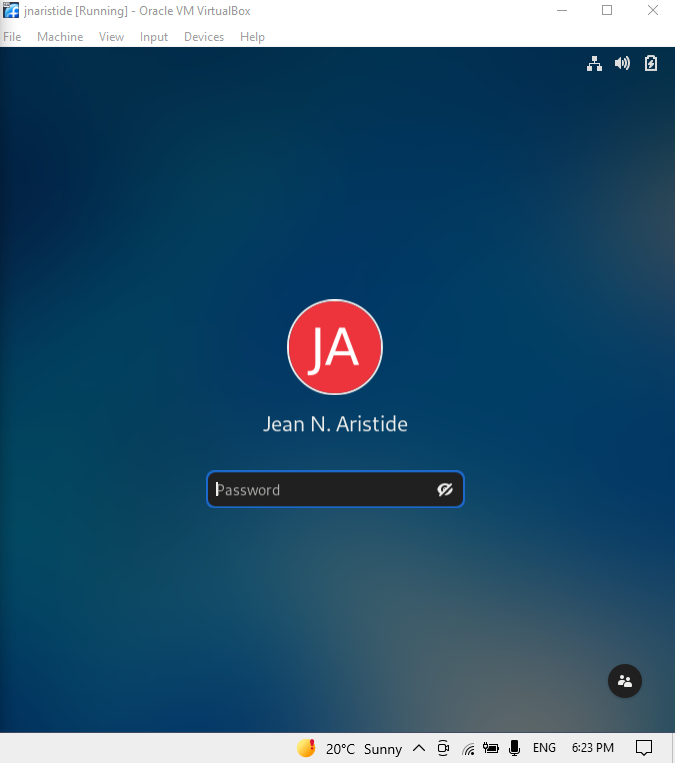
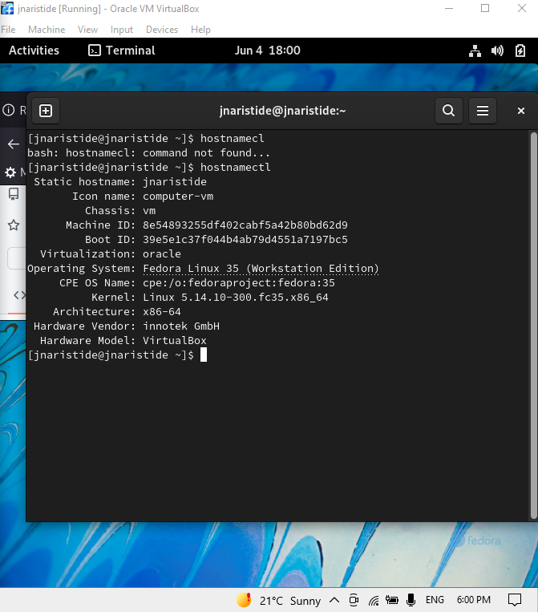
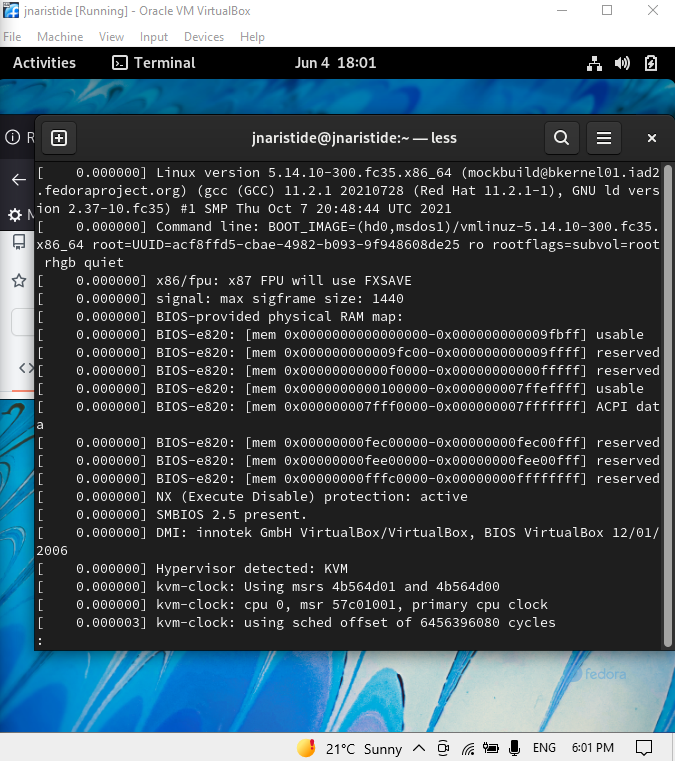

---
## Front matter
title: "Отчёта по лабораторной работе 1"
subtitle: "Виртуалная машина и Linux"
author: "Аристид Жан Лоэнс Аристобуль Надаль"

## Generic otions
lang: ru-RU
toc-title: "Содержание"

## Bibliography
bibliography: bib/cite.bib
csl: pandoc/csl/gost-r-7-0-5-2008-numeric.csl

## Pdf output format
toc: true # Table of contents
toc-depth: 2
lof: true # List of figures
lot: true # List of tables
fontsize: 12pt
linestretch: 1.5
papersize: a4
documentclass: scrreprt
## I18n polyglossia
polyglossia-lang:
  name: russian
  options:
	- spelling=modern
	- babelshorthands=true
polyglossia-otherlangs:
  name: english
## I18n babel
babel-lang: russian
babel-otherlangs: english
## Fonts
mainfont: PT Serif
romanfont: PT Serif
sansfont: PT Sans
monofont: PT Mono
mainfontoptions: Ligatures=TeX
romanfontoptions: Ligatures=TeX
sansfontoptions: Ligatures=TeX,Scale=MatchLowercase
monofontoptions: Scale=MatchLowercase,Scale=0.9
## Biblatex
biblatex: true
biblio-style: "gost-numeric"
biblatexoptions:
  - parentracker=true
  - backend=biber
  - hyperref=auto
  - language=auto
  - autolang=other*
  - citestyle=gost-numeric
## Pandoc-crossref LaTeX customization
figureTitle: "Рис."
tableTitle: "Таблица"
listingTitle: "Листинг"
lofTitle: "Список иллюстраций"
lotTitle: "Список таблиц"
lolTitle: "Листинги"
## Misc options
indent: true
header-includes:
  - \usepackage{indentfirst}
  - \usepackage{float} # keep figures where there are in the text
  - \floatplacement{figure}{H} # keep figures where there are in the text
---

# Цель работы
- Целью данной работы является приобретение практических навыков установки операционной системы на виртуальную машину, настройки минимально необходимых для дальнейшей работы сервисов

# Ход работы

Сначала, Я скачал дистрибутив Fedora с этого сайта. (рис. [-@fig:001])

{ #fig:001 width=70% }

Я его установил в виртуальном машине. (рис. [-@fig:002])

{ #fig:002 width=70% }

Я сделал некоторые настройки для лучшего использования Fedora в виртуальной машине. (рис. [-@fig:003])

{ #fig:003 width=70% }

Я создал учетную запись пользователя и пароль (рис. [-@fig:004])

{ #fig:004 width=70% }

С командой hostnamectl, Проверил, что имя хоста установлено верно. (рис. [-@fig:005])

{ #fig:005 width=70% }

проанализировал последовательность загрузки системы, выполнив команду dmesg. (рис. [-@fig:006])

{ #fig:006 width=70% }

# Контрольные вопросы
1. Какую информацию содержит учётная запись пользователя?
  - учётная запись пользователя содержит имя пользователя.
2. Укажите команды терминала и приведите примеры:
  – для получения справки по команде
   Мы можем использавать --help. Наприме: cd --help.
  - для перемещения по файловой системе;
  Мы можем использавать cd. Например: cd ~.
  – для просмотра содержимого каталога;
  Мы можем использавать ls. Например: ls ~/Desktop/.
  – для определения объёма каталога;
  Мы можем использавать du. Например: du ~/Desktop/.
  – для создания / удаления каталогов / файлов;
  Мы можем использавать mkdir для создания каталогов. Например: mkdir ~/docu/.
  Мы можем использавать rmdir для удаления каталогов. Например: rmdir ~/docu/.
  Мы можем использавать touch для создания файлов. Например: touch ~/Desktop/text.txt.
  Мы можем использавать rm для удаления файлов. Например: rm ~/Desktop/text.txt.
  -для задания определённых прав на файл / каталог
  Мы можем использавать chmod. Например: chmod u+w ~/Desktop/direc
  – для просмотра истории команд.
  Мы можем использавать history. Например: history.
3. Что такое файловая система? Приведите примеры с краткой характеристикой.
файловая система— это метод и структура данных, которые операционная система использует для управления хранением данных.
4. Как посмотреть, какие файловые системы подмонтированы в ОС?
   Мы можем использавать fsck.
5.  Как удалить зависший процесс?
    Мы можем использавать CTRL + C.

# Выводы

- Во время этой лабораторной работы, мы мы научились работать с виртуальной машиной и устанавливать на нее дистрибутив Linux.

