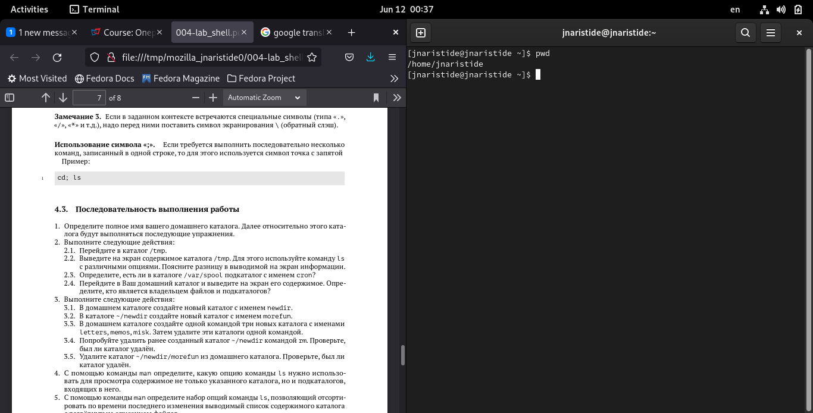
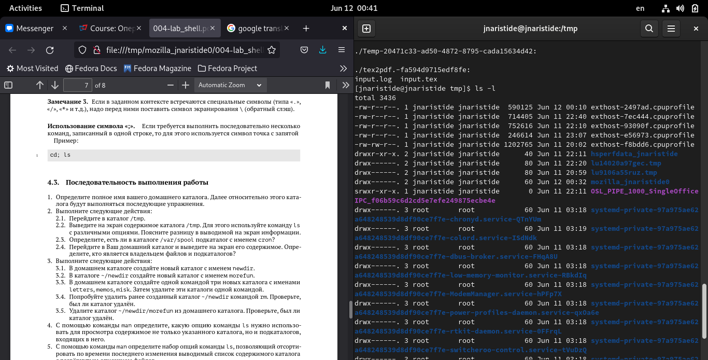
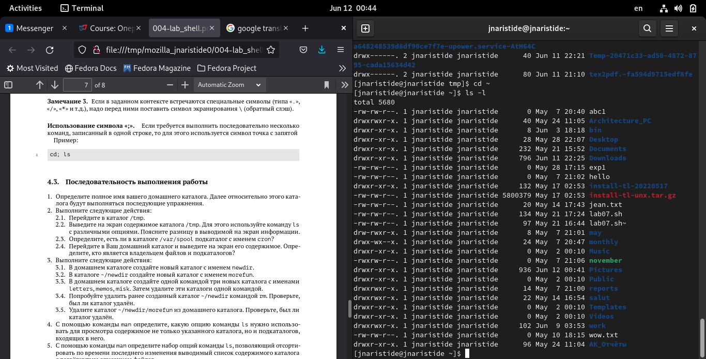
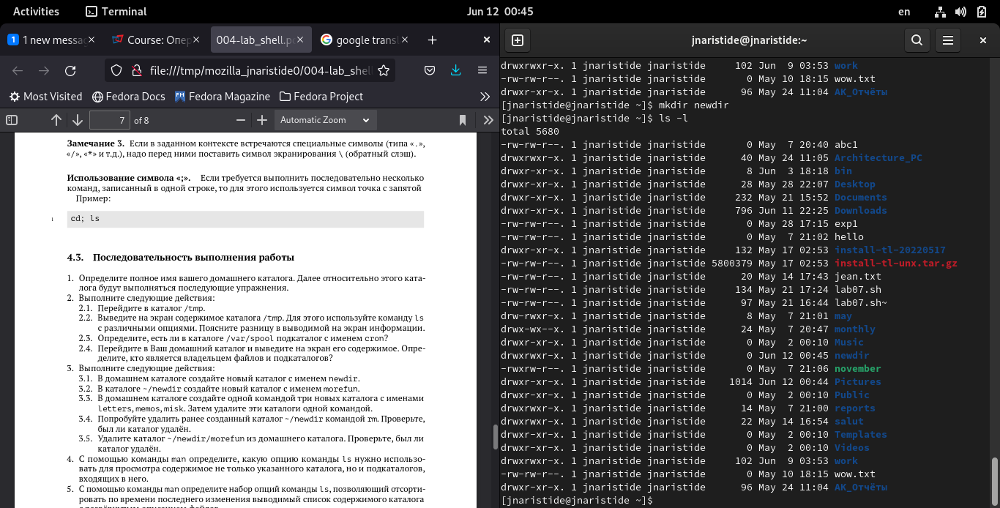
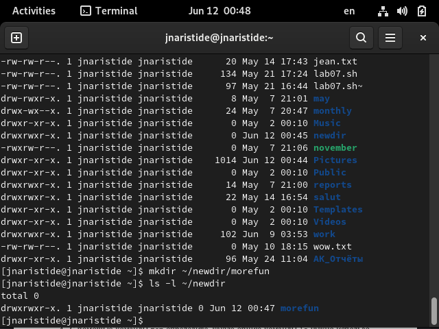
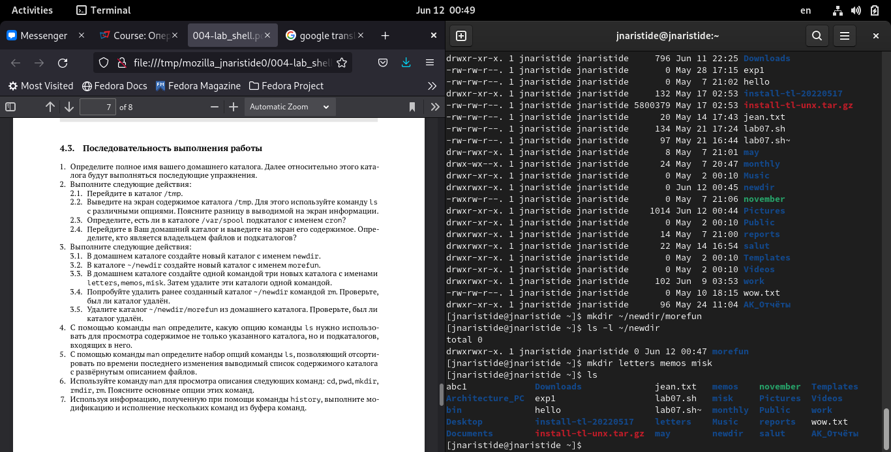
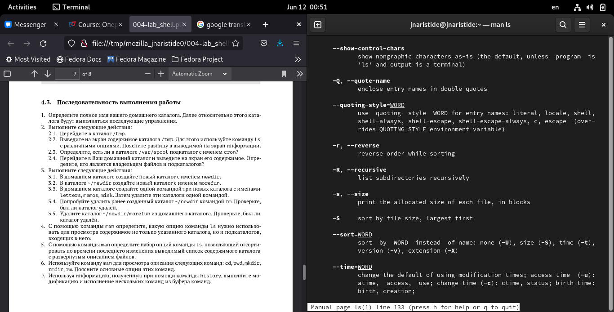
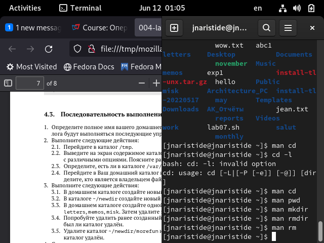
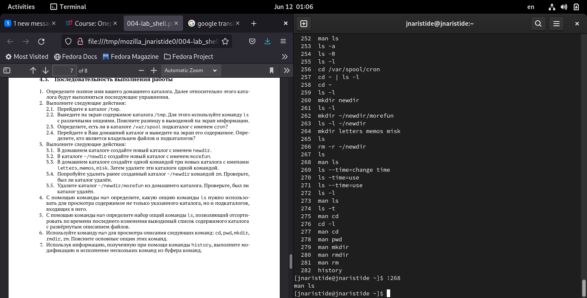
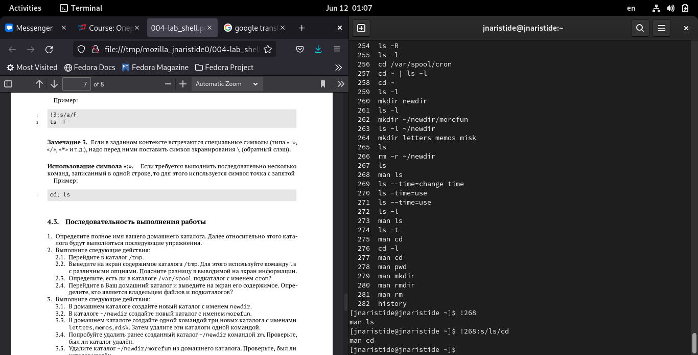

---
## Front matter
title: "Отчёта по лабораторной работе 4"
subtitle: "Командна сторки"
author: "Аристид Жан Лоэнс Аристобуль Надаль"

## Generic otions
lang: ru-RU
toc-title: "Содержание"

## Bibliography
bibliography: bib/cite.bib
csl: pandoc/csl/gost-r-7-0-5-2008-numeric.csl

## Pdf output format
toc: true # Table of contents
toc-depth: 2
lof: true # List of figures
lot: true # List of tables
fontsize: 12pt
linestretch: 1.5
papersize: a4
documentclass: scrreprt
## I18n polyglossia
polyglossia-lang:
  name: russian
  options:
	- spelling=modern
	- babelshorthands=true
polyglossia-otherlangs:
  name: english
## I18n babel
babel-lang: russian
babel-otherlangs: english
## Fonts
mainfont: PT Serif
romanfont: PT Serif
sansfont: PT Sans
monofont: PT Mono
mainfontoptions: Ligatures=TeX
romanfontoptions: Ligatures=TeX
sansfontoptions: Ligatures=TeX,Scale=MatchLowercase
monofontoptions: Scale=MatchLowercase,Scale=0.9
## Biblatex
biblatex: true
biblio-style: "gost-numeric"
biblatexoptions:
  - parentracker=true
  - backend=biber
  - hyperref=auto
  - language=auto
  - autolang=other*
  - citestyle=gost-numeric
## Pandoc-crossref LaTeX customization
figureTitle: "Рис."
tableTitle: "Таблица"
listingTitle: "Листинг"
lofTitle: "Список иллюстраций"
lotTitle: "Список таблиц"
lolTitle: "Листинги"
## Misc options
indent: true
header-includes:
  - \usepackage{indentfirst}
  - \usepackage{float} # keep figures where there are in the text
  - \floatplacement{figure}{H} # keep figures where there are in the text
---

# Цель работы

- Приобретение практических навыков взаимодействия пользователя с системой по-
средством командной строки.

# Ход Работы

Определил полное имя вашего домашнего каталога (рис. [-@fig:001])

{ #fig:001 width=70% }

Переместил в каталоге /tmp (рис. [-@fig:002])

{ #fig:002 width=70% }

Посмотрел содержание каталога /tmp (рис. [-@fig:003])

{ #fig:003 width=70% }

Посмотрел Содержание домашнего каталога  (рис. [-@fig:004])

{ #fig:004 width=70% }

Создал каталог newdir при помощи команда mkdir (рис. [-@fig:005])

{ #fig:005 width=70% }

Создал подкаталог morefun (рис. [-@fig:006])

{ #fig:006 width=70% }

Создал каталоги letters memos misk (рис. [-@fig:007])

{ #fig:007 width=70% }

Информациии о команде ls при помощи команда man (рис. [-@fig:008])

{ #fig:008 width=70% }

Информациии о команде cd, pwd, mkdir, rmdir, rm при помощи команда man (рис. [-@fig:009])

{ #fig:009 width=70% }

Исползовал команд history (рис. [-@fig:010])

{ #fig:010 width=70% }

Исползовал конструкци !<Номер_команды> (рис. [-@fig:011])

{ #fig:011 width=70% }

Исползовал конструкци !<номер_команды>:s/<что_меняем>/<на_что_меняем> (рис. [-@fig:012])

{ #fig:012 width=70% }

# Выводы

- В ходе этой лабораторной работы мы научились взаимодействовать с системой через строки команд для вызова из терминала.

