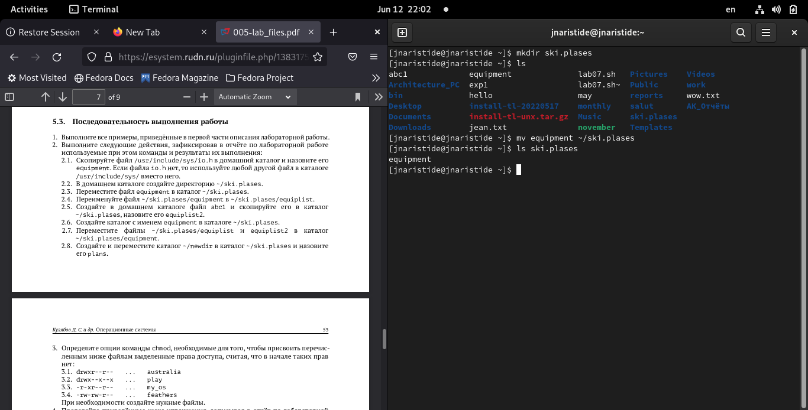

---
## Front matter
title: "Отчёт по лабораторной работе 5"
subtitle: "Файловая системы Linux"
author: "Аристид Жан Лоэнс Аристобуль"

## Generic otions
lang: ru-RU
toc-title: "Содержание"

## Bibliography
bibliography: bib/cite.bib
csl: pandoc/csl/gost-r-7-0-5-2008-numeric.csl

## Pdf output format
toc: true # Table of contents
toc-depth: 2
lof: true # List of figures
lot: true # List of tables
fontsize: 12pt
linestretch: 1.5
papersize: a4
documentclass: scrreprt
## I18n polyglossia
polyglossia-lang:
  name: russian
  options:
	- spelling=modern
	- babelshorthands=true
polyglossia-otherlangs:
  name: english
## I18n babel
babel-lang: russian
babel-otherlangs: english
## Fonts
mainfont: PT Serif
romanfont: PT Serif
sansfont: PT Sans
monofont: PT Mono
mainfontoptions: Ligatures=TeX
romanfontoptions: Ligatures=TeX
sansfontoptions: Ligatures=TeX,Scale=MatchLowercase
monofontoptions: Scale=MatchLowercase,Scale=0.9
## Biblatex
biblatex: true
biblio-style: "gost-numeric"
biblatexoptions:
  - parentracker=true
  - backend=biber
  - hyperref=auto
  - language=auto
  - autolang=other*
  - citestyle=gost-numeric
## Pandoc-crossref LaTeX customization
figureTitle: "Рис."
tableTitle: "Таблица"
listingTitle: "Листинг"
lofTitle: "Список иллюстраций"
lotTitle: "Список таблиц"
lolTitle: "Листинги"
## Misc options
indent: true
header-includes:
  - \usepackage{indentfirst}
  - \usepackage{float} # keep figures where there are in the text
  - \floatplacement{figure}{H} # keep figures where there are in the text
---

# Цель работы

- Ознакомление с файловой системой Linux, её структурой, именами и содержанием каталогов. Приобретение практических навыков по применению команд для работы с файлами и каталогами,по управлению процессами (и работами),по проверке использования диска и обслуживанию файловой системы

# Выполнение лабораторной работы

Выполнитевсепримеры,приведённыевпервойчастиописаниялабораторнойработы. (рис. [-@fig:001])

{ #fig:001 width=70% }

Скопировал файл /usr/include/sys/io.h в домашний каталоги назовите его equipment. (рис. [-@fig:002])

{ #fig:002 width=70% }

Домашнем каталоге создал директорию ~/ski.plases. (рис. [-@fig:003])

{ #fig:003 width=70% }

Переместил файл equipment в каталог ~/ski.plases. (рис. [-@fig:004])

{ #fig:004 width=70% }

Переименовал файл ~/ski.plases/equipment в /ski.plases/equiplist. (рис. [-@fig:005])

{ #fig:005 width=70% }

Создал в домашнем каталоге файл abc1 и скопировал его в каталог ~/ski.plases,назовите его equiplist2 (рис. [-@fig:006])

{ #fig:006 width=70% }

Создал каталог с именем equipment в каталоге ~/ski.plases. (рис. [-@fig:007])

{ #fig:007 width=70% }

Переместил файлы ~/ski.plases/equiplist и equiplist2 в каталог /ski.plases/equipment. (рис. [-@fig:008])

{ #fig:008 width=70% }

Создал и переместил каталог ~/newdir в каталог /ski.plases и назовите его plans. (рис. [-@fig:009])

{ #fig:009 width=70% }

Мы изменили права доступа эти файли и каталоги. (рис. [-@fig:010])

{ #fig:010 width=70% }

Просмотрил содержимое файла /etc/password. (рис. [-@fig:011])

{ #fig:011 width=70% }

Скопировал файл ~/feathers в файл /file.old. (рис. [-@fig:012])

{ #fig:012 width=70% }

Скопировал каталог ~/play в каталог /fun. (рис. [-@fig:013])

{ #fig:013 width=70% }

Переместил файл ~/file.old в каталог /play. (рис. [-@fig:014])

{ #fig:014 width=70% }

Прочитал man по командам mount,fsck,mkfs,kill (рис. [-@fig:015])

# Выводы

- В ходе этого лабораторного занятия мы углубили свои знания об использовании команд, используемых в терминале, для взаимодействия с файловой системой Linux.