---
## Front matter
title: "Отчёт по лабораторной работе 6"
subtitle: "Перенаправление ввода-вывода"
author: "Аристид Жан Лоэнс Аристобуль Надаль"

## Generic otions
lang: ru-RU
toc-title: "Содержание"

## Bibliography
bibliography: bib/cite.bib
csl: pandoc/csl/gost-r-7-0-5-2008-numeric.csl

## Pdf output format
toc: true # Table of contents
toc-depth: 2
lof: true # List of figures
lot: true # List of tables
fontsize: 12pt
linestretch: 1.5
papersize: a4
documentclass: scrreprt
## I18n polyglossia
polyglossia-lang:
  name: russian
  options:
	- spelling=modern
	- babelshorthands=true
polyglossia-otherlangs:
  name: english
## I18n babel
babel-lang: russian
babel-otherlangs: english
## Fonts
mainfont: PT Serif
romanfont: PT Serif
sansfont: PT Sans
monofont: PT Mono
mainfontoptions: Ligatures=TeX
romanfontoptions: Ligatures=TeX
sansfontoptions: Ligatures=TeX,Scale=MatchLowercase
monofontoptions: Scale=MatchLowercase,Scale=0.9
## Biblatex
biblatex: true
biblio-style: "gost-numeric"
biblatexoptions:
  - parentracker=true
  - backend=biber
  - hyperref=auto
  - language=auto
  - autolang=other*
  - citestyle=gost-numeric
## Pandoc-crossref LaTeX customization
figureTitle: "Рис."
tableTitle: "Таблица"
listingTitle: "Листинг"
lofTitle: "Список иллюстраций"
lotTitle: "Список таблиц"
lolTitle: "Листинги"
## Misc options
indent: true
header-includes:
  - \usepackage{indentfirst}
  - \usepackage{float} # keep figures where there are in the text
  - \floatplacement{figure}{H} # keep figures where there are in the text
---

# Цель работы

- Ознакомление с инструментами поиска файлов и фильтрации текстовых данных. Приобретение практических навыков: по управлению процессами (и заданиями), по проверке использования диска и обслуживанию файловых систем.

# Выполнение лабораторной работы

Запишил в файл file.txt названия файлов,содержащихся в каталоге /etc.Допишил в этот же файл названия файлов,содержащихся в вашем домашнем каталоге. (рис. [-@fig:002])

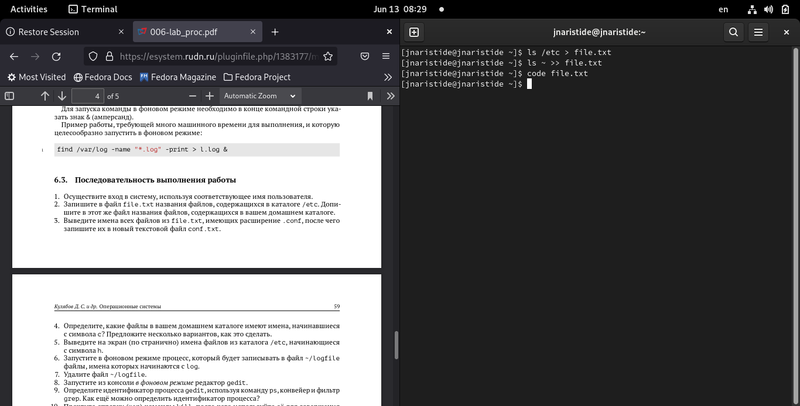{ #fig:002 width=70% }

Выведил имена всех файлов из file.txt,имеющих расширение .conf,после чего запишите их в новыйтекстовой файл conf.txt.(рис. [-@fig:003])

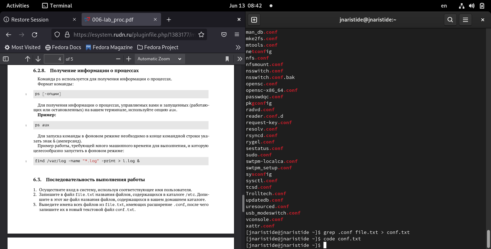{ #fig:003 width=70% }

Определил,какие файлы в вашем домашнем каталоге имеют имена,начинавшиеся с символа c (рис. [-@fig:004])

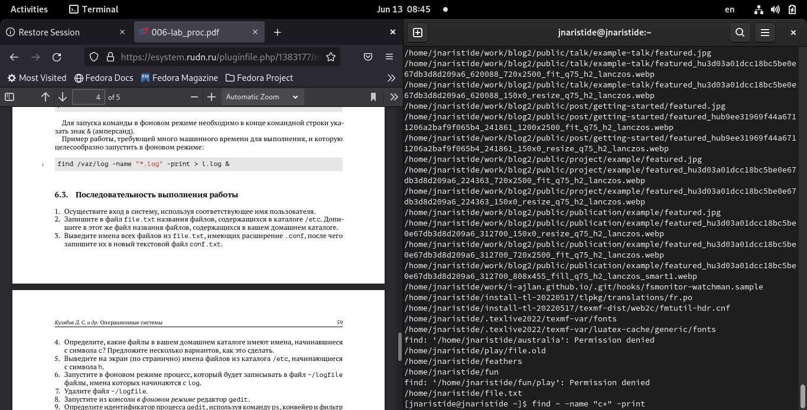{ #fig:004 width=70% }

Выведил на экран (по странично) имена файлов из каталога /etc,начинающиеся с символа h (рис. [-@fig:005])

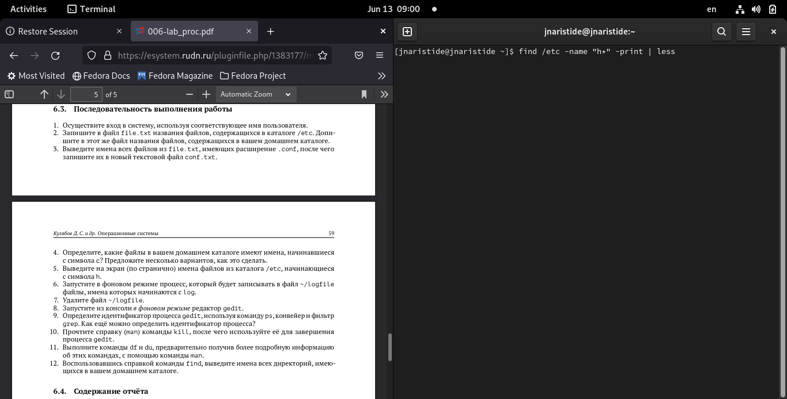{ #fig:005 width=70% }

Запустил в фоновом режиме процесс,который будетзаписывать в файл ~/logfile файлы,имена которых начинаются с log (рис. [-@fig:006])

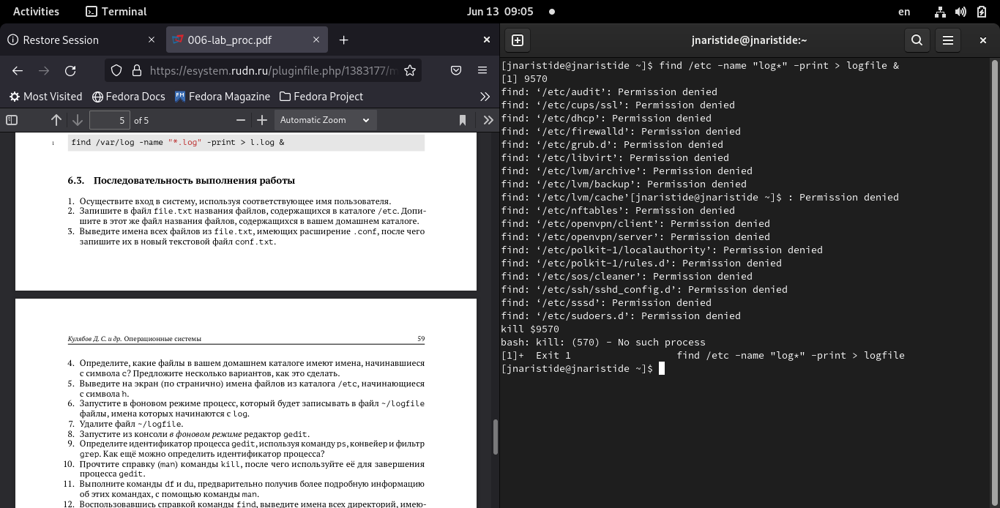{ #fig:006 width=70% }

Удалил файл ~/logfile. (рис. [-@fig:007])

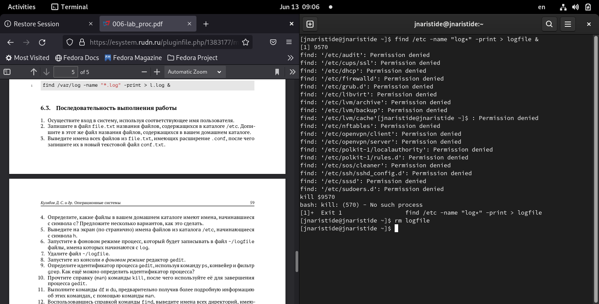{ #fig:007 width=70% }

Запустил из консоли в фоновом режиме редактор gedit. (рис. [-@fig:008])

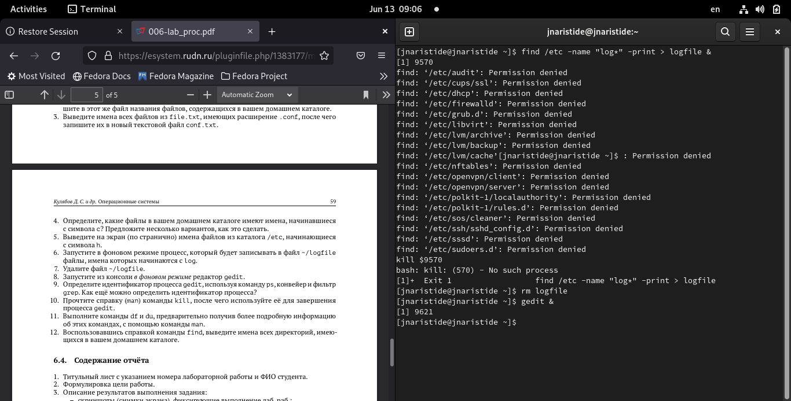{ #fig:008 width=70% }

Определил идентификаторпроцесса gedit,используякомандуps,конвейерифильтр grep. (рис. [-@fig:009])

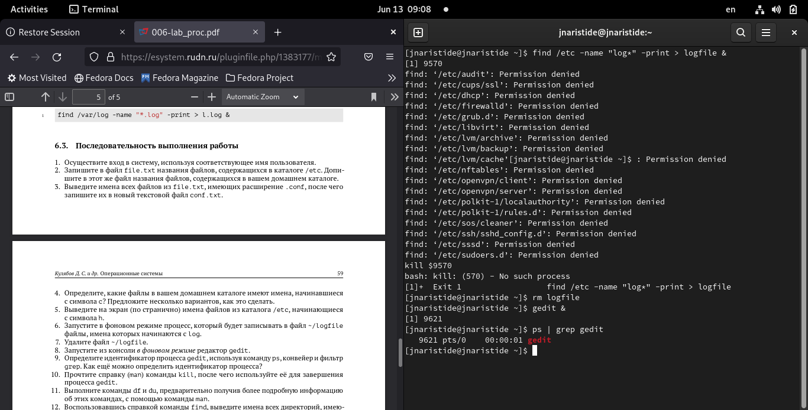{ #fig:009 width=70% }

Прочтил справку (man) команды kill, после чего используйте её для завершения процесса gedit (рис. [-@fig:010])

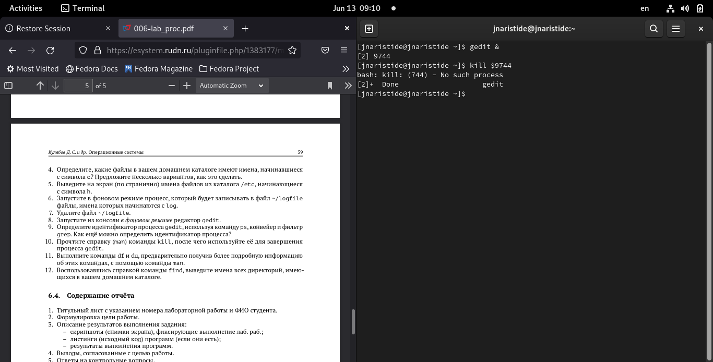{ #fig:010 width=70% }

Выполнил команды df и du,предварительно получив более подробную информацию об этих командах, с помощью команды man(рис. [-@fig:011])

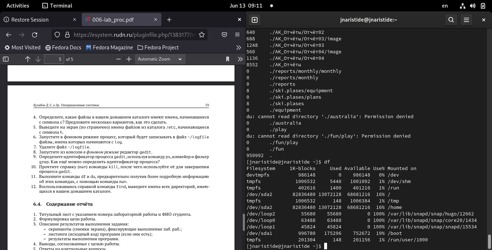{ #fig:011 width=70% }

Воспользовавшись справкой команды find,выведил имена всех директорий,имеющихся в вашем домашнем каталоге (рис. [-@fig:012])

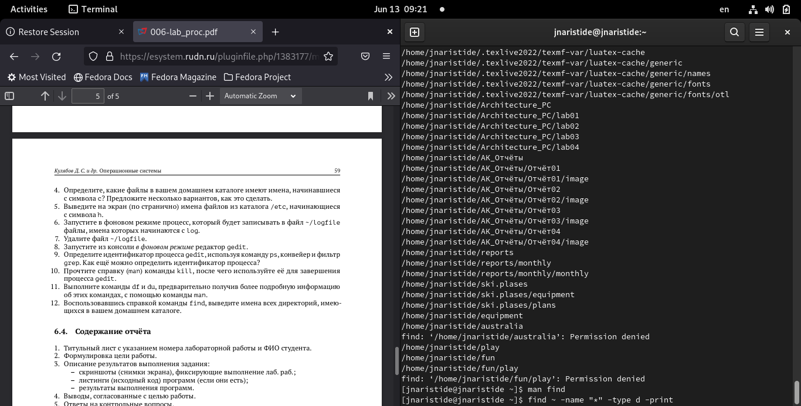{ #fig:012 width=70% }

# Выводы

- В ходе этого лабораторного занятия мы еще больше углубили свои знания, используя новые команды в терминале для взаимодействия с файловой системой Linux.

