---
## Front matter
title: "Отчёт по лабораторной работе 09"
subtitle: "Простейший вариант"
author: "Аристид Жан Лоэнс Аристид Надаль"

## Generic otions
lang: ru-RU
toc-title: "Содержание"

## Bibliography
bibliography: bib/cite.bib
csl: pandoc/csl/gost-r-7-0-5-2008-numeric.csl

## Pdf output format
toc: true # Table of contents
toc-depth: 2
lof: true # List of figures
lot: true # List of tables
fontsize: 12pt
linestretch: 1.5
papersize: a4
documentclass: scrreprt
## I18n polyglossia
polyglossia-lang:
  name: russian
  options:
	- spelling=modern
	- babelshorthands=true
polyglossia-otherlangs:
  name: english
## I18n babel
babel-lang: russian
babel-otherlangs: english
## Fonts
mainfont: PT Serif
romanfont: PT Serif
sansfont: PT Sans
monofont: PT Mono
mainfontoptions: Ligatures=TeX
romanfontoptions: Ligatures=TeX
sansfontoptions: Ligatures=TeX,Scale=MatchLowercase
monofontoptions: Scale=MatchLowercase,Scale=0.9
## Biblatex
biblatex: true
biblio-style: "gost-numeric"
biblatexoptions:
  - parentracker=true
  - backend=biber
  - hyperref=auto
  - language=auto
  - autolang=other*
  - citestyle=gost-numeric
## Pandoc-crossref LaTeX customization
figureTitle: "Рис."
tableTitle: "Таблица"
listingTitle: "Листинг"
lofTitle: "Список иллюстраций"
lotTitle: "Список таблиц"
lolTitle: "Листинги"
## Misc options
indent: true
header-includes:
  - \usepackage{indentfirst}
  - \usepackage{float} # keep figures where there are in the text
  - \floatplacement{figure}{H} # keep figures where there are in the text
---

# Цель работы

-Познакомиться с операционной системой Linux.Получить практические навыки работы с редактором Emacs.

# Выполнение лабораторной работы

1.Открыл редактор emacs(рис. [-@fig:001])

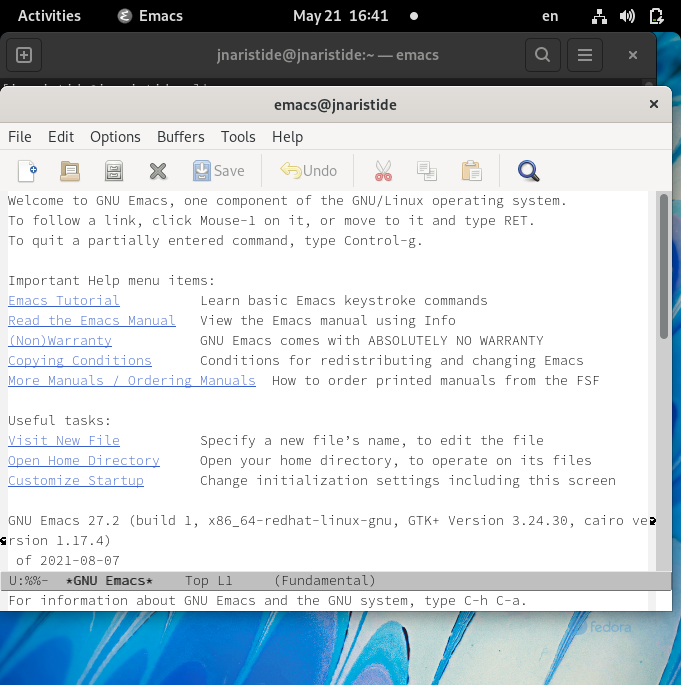{ #fig:001 width=70% }

2.Создал файл lab07.sh с помощью комбинации(рис. [-@fig:002])

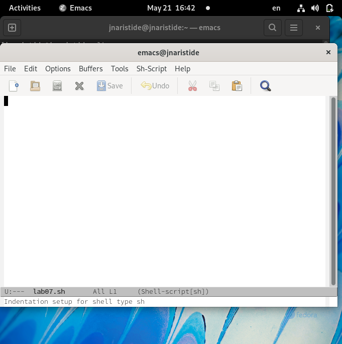{ #fig:002 width=70% }

3.Наберил текст следующый:(рис. [-@fig:003])
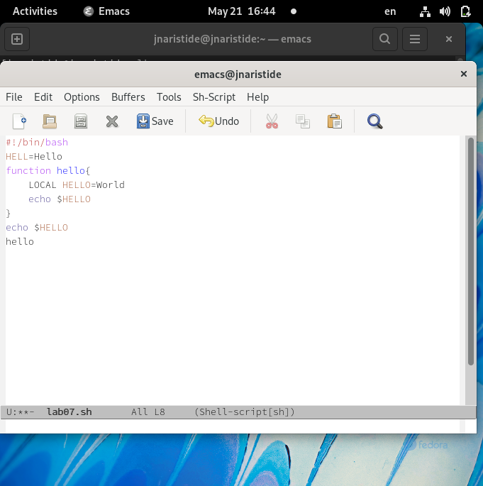{ #fig:003 width=70% }

4.Сохранить файл с помощью комбинации(рис. [-@fig:004])
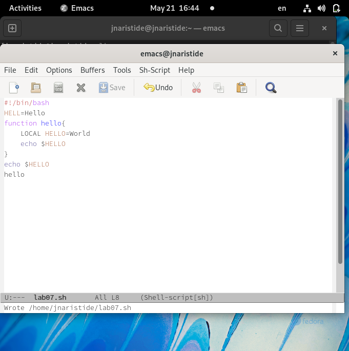{ #fig:004 width=70% }

5.1. Вырезал одной командой целую строку (С-k).(рис. [-@fig:005])
{ #fig:005 width=70% }

5.2. Вставил эту строку в конец файла (C-y).(рис. [-@fig:006])
{ #fig:006 width=70% }

5.3. Выделил областьтекста (C-space).(рис. [-@fig:007])
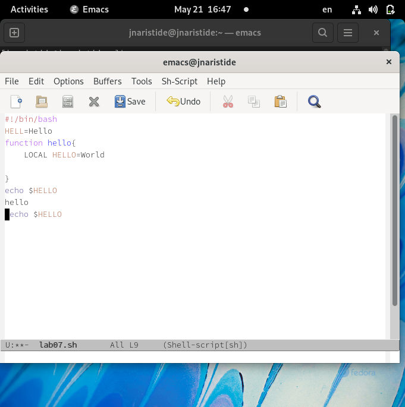{ #fig:007 width=70% }

5.4. Скопировал область в буфер обмена (M-w).(рис. [-@fig:008])
{ #fig:008 width=70% }

5.5. Вставил область в конец файла(рис. [-@fig:009])
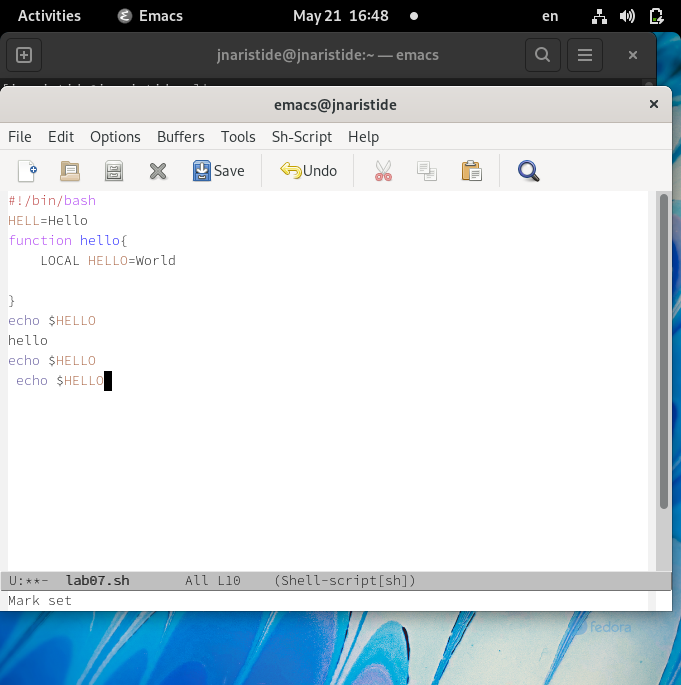{ #fig:009 width=70% }

5.6. Вновь выделил эту область и на этотраз вырезать её (C-w)(рис. [-@fig:010])
{ #fig:010 width=70% }

5.7. Отменил последнее действие (C-/)(рис. [-@fig:011])
{ #fig:011 width=70% }

6.1. Переместил курсор в начало строки (C-a)(рис. [-@fig:012])
{ #fig:012 width=70% }

6.2. Переместил курсор в конец строки (C-e).(рис. [-@fig:013])
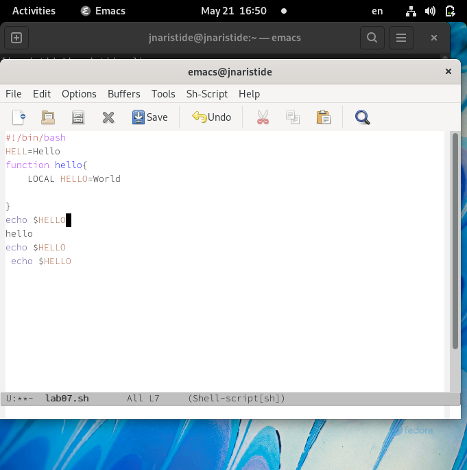{ #fig:013 width=70% }

6.3. Переместил курсор в начало буфера (M-<).(рис. [-@fig:014])
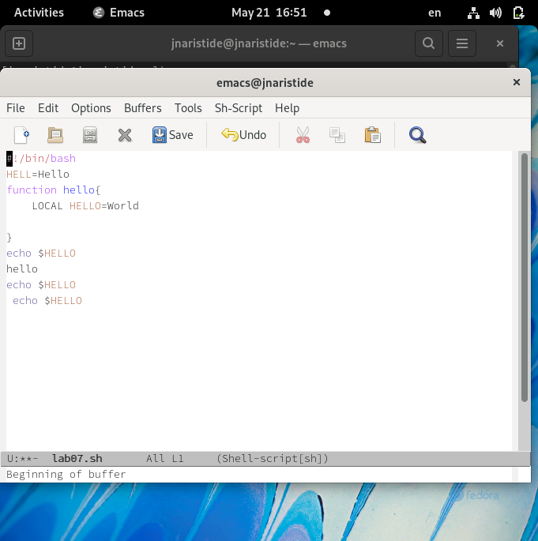{ #fig:014 width=70% }

6.4. Переместил курсор в конец буфера (M->)
{ #fig:015 width=70% }(рис. [-@fig:015])

7.1. Вывести список активных буферов на экран (C-x C-b)(рис. [-@fig:016])
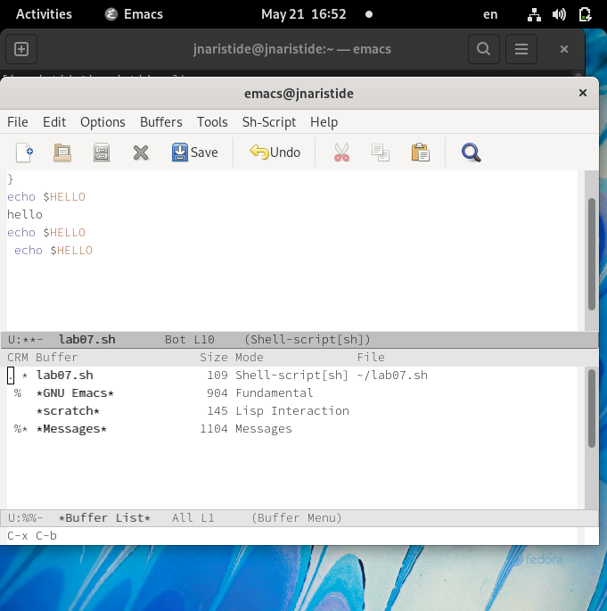{ #fig:016 width=70% }

7.2. Переместилсь во вновь открытое окно (C-x) o со списком открытых буферов
и переключитесь на другой буфер(рис. [-@fig:017])
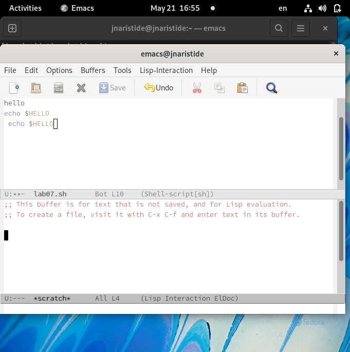{ #fig:017 width=70% }

7.3. Закройте это окно (C-x 0)(рис. [-@fig:018])
{ #fig:018 width=70% }

7.4. Теперь вновь переключайтесь между буферами,но уже без вывода их списка на
экран (C-x b).(рис. [-@fig:019])
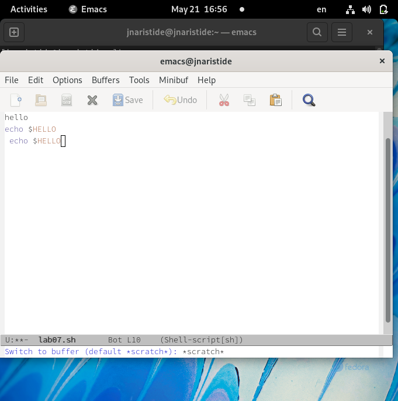{ #fig:019 width=70% }

8.1. Поделите фрейм на 4 части: разделите фрейм на два окна по вертикали (C-x 3),
а затем каждое из этих окон на две части по горизонтали (C-x 2) (см.рис. 9.1).(рис. [-@fig:020])
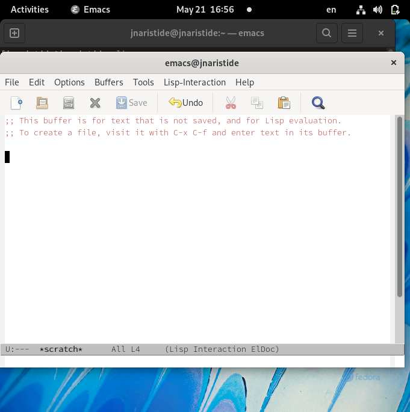{ #fig:020 width=70% }

8.2. В каждом из четырёх созданных окон откройте новый буфер (файл) и введите
несколько строктекста.(рис. [-@fig:021])
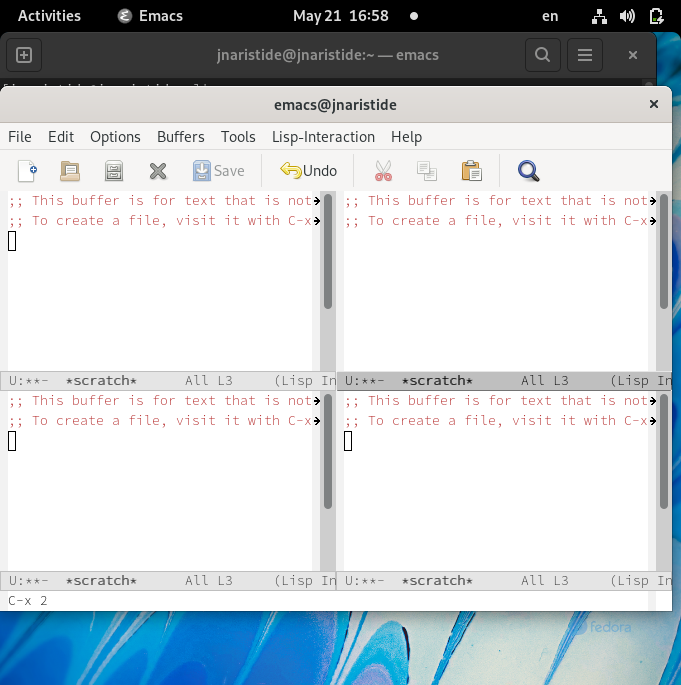{ #fig:021 width=70% }

9.1. Переключитесьв режим поиска (C-s) и найдите несколько слов,присутствующих
втексте.(рис. [-@fig:022])
{ #fig:022 width=70% }

9.2. Переключайтесь между результатами поиска,нажимая C-s(рис. [-@fig:023])
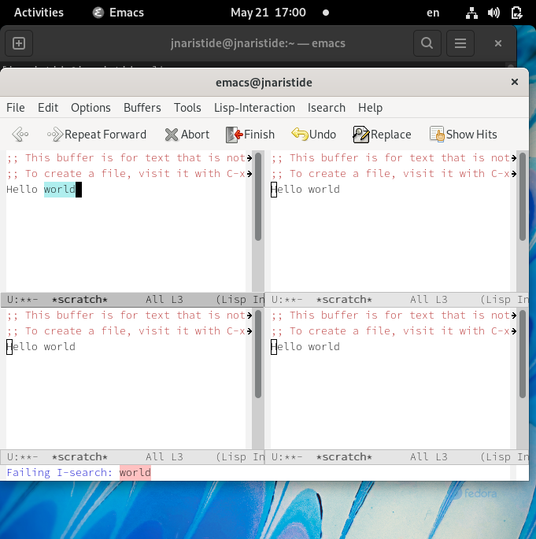{ #fig:023 width=70% }

9.3. Выйдите из режима поиска,нажав C-g(рис. [-@fig:024])
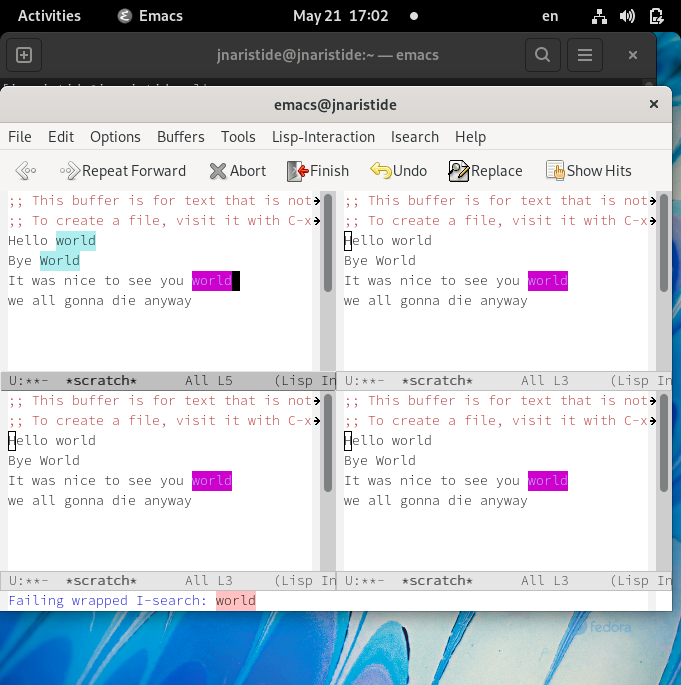{ #fig:024 width=70% }

9.4. Перейдите в режим поиска и замены (M-%),введитетекст,который следует найти
и заменить,нажмите Enter ,затем введитетекстдля замены.Послетого как будут
подсвечены результаты поиска,нажмите ! для подтверждения замены.(рис. [-@fig:025])
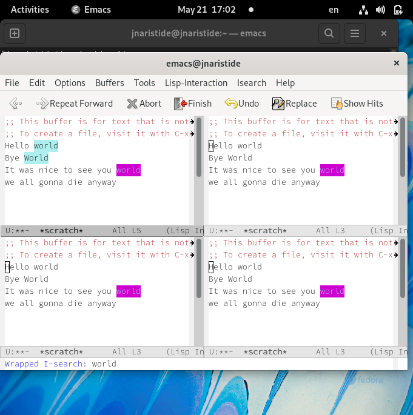{ #fig:024 width=70% }

9.5. Испробуйте другой режим поиска,нажав M-s o.Объясните,чем он отличается от
обычного режима?(рис. [-@fig:026])
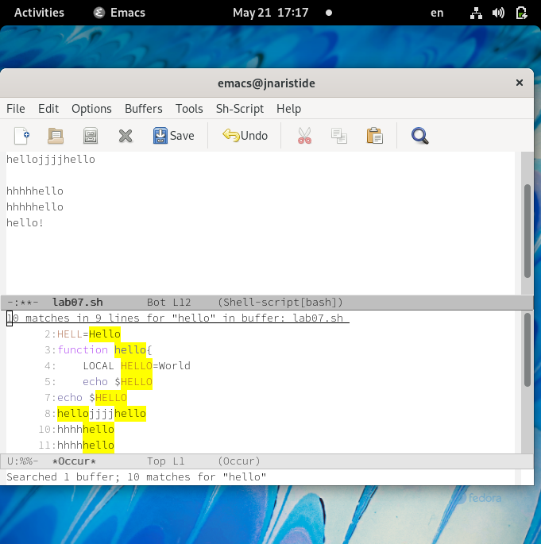{ #fig:026 width=70% }

# Вывод
-В этой лабораторной работе мы научились перемещаться по редактору emacs, в основном используя комбинации клавиш.

